# Scene Graph Design

Based on discussion from 2025-11-11 and current implementation state of `lp-script`, `lp-data`, and `lp-math`.

## Overview

The LightPlayer scene graph is a node-based system for creating LED light effects. Nodes are organized left-to-right from input sources through effect processing, muxing, fixture mapping, and finally output to hardware.

## Architecture Principles

1. **Pull-based evaluation** - Data flows from right to left (renderer pulls from effects)
2. **Modular composition** - Nodes combine into reusable modules
3. **Stateful and stateless** - Clear distinction between filter pipelines and stateful simulations
4. **Hardware abstraction** - Fixtures handle LED format mapping (RGB, RGBW, GRB, etc.)
5. **Live editing** - All nodes can be modified at runtime

### Node Category Overview


## Node Categories

The scene graph flows left-to-right through these categories:

### 1. Input Nodes (`ui:*`)

Input nodes represent user interface elements or input devices. They produce values consumed by other nodes.

**Types:**

- `ui:button` / `ui:momentary` - Button press events
- `ui:slider` - Continuous value control (min, max, step, default)
- `ui:color-picker` - Color selection
- `ui:palette` - Color palette selection
- `ui:audio-input` - Audio signal input (future)
- `ui:camera` - Camera input (future)

**Characteristics:**

- Produce scalar or vector outputs
- Can have hardware sources (e.g., `gpio:1,pull-up`)
- User-visible in the UI for direct control
- May emit events (e.g., `on:press`)

**Example:**

```toml
[contrast]
type = "ui:slider"
min = 0.1
max = 2.0
step = 0.01
default = 1.5
sources = ["gpio:2"]  # Optional hardware source
```

### 2. Math Nodes (`math:*`)

Math nodes are stateful drivers of data. They produce time-varying or computed values.

**Types:**

- `math:lfo` - Low-frequency oscillator (sine, triangle, square, sawtooth)
- `math:oscillator` - General oscillator (future)
- `math:noise` - Noise generators (future)

**Characteristics:**

- Stateful - maintain internal state across frames
- Time-based - typically driven by frame time
- Produce scalar or vector outputs
- Configurable parameters (period, range, waveform)

**Example:**

```toml
[zoom]
type = "math:lfo"
period_ms = 5000
range = [0.1, 2.0]
waveform = "sine"
```

**Implementation Notes:**

- Uses `lp-math` fixed-point arithmetic
- State persists across frames via `save_state()` / `restore_state()`

### 3. Effect Nodes (`effect:*`)

Effect nodes process images (2D buffers). They can be stateless pipelines or stateful simulations.

#### 3.1 Effect Pipeline (`effect:pipeline`)

A stateless sequence of filter steps, similar to CSS filters. Each step transforms the image buffer.

**Pipeline Steps:**

- `expr` - Execute lp-script expression (GLSL-like shader code)
- `palette` - Convert greyscale to RGB using color palette
- `color` - Fill buffer with solid color
- `blur` - Apply Gaussian blur (future)

**Characteristics:**

- Stateless - pure transformations, no internal state
- Sequential - steps execute in order
- Uniforms - steps can reference other node outputs
- Buffer format - steps specify input/output formats (greyscale, RGB, etc.)

**Example:**

```toml
[perlin]
type = "effect:pipeline"
steps = [
    {
        type = "expr",
        uniforms = { zoom = "children.zoom.output" },
        glsl = "perlin3(uv * zoom, time)",
        output_format = "greyscale"
    },
    {
        type = "expr",
        uniforms = { contrast = "children.contrast.output" },
        glsl = "pow(input, contrast)",
        output_format = "greyscale"
    },
    {
        type = "palette",
        palette = "builtin:rainbow",
        output_format = "rgb"
    }
]
```

**Pipeline Step Flow:**


**Implementation Notes:**

- Uses `lp-script` for expression compilation and execution
- Buffer management handled by `engine-core` pipeline runtime
- Steps can reference `input` for previous step's output

#### 3.2 Stateful Effects

Effects that maintain state across frames (not yet implemented):

- `effect:fluid` - Fluid simulation
- `effect:cellular-automata` - Cellular automata
- `effect:fire` - Fire simulation

**Characteristics:**

- Stateful - maintain internal buffers/state
- Frame-to-frame continuity required
- May need `save_state()` / `restore_state()` for live editing

### 4. Muxing System (`mux:*`)

Mux nodes select which effect/image to use at the current time. They take multiple image inputs and produce a single output.

**Types:**

- `mux:timeline` - Iterate through effects on a schedule
- `mux:select` - Select effect based on user input (most interesting interaction)
- `mux:blend` - Blend between effects (future)

**Characteristics:**

- Multiple image inputs
- Selection logic (time-based or input-based)
- Outputs single image
- May track priority and user interaction state

**Example:**

```toml
[chooser]
type = "mux:select"
effects = "children"  # References child effect nodes
selection_mode = "most-interactive"  # Select effect with active user input
```

**Selection Logic:**

- Timeline: Cycle through effects based on time schedule
- Select: Choose effect with most interesting user input (button press, slider movement)
- When user interacts, that effect becomes active until interaction stops

### 5. Fixture Nodes (`fixture:*`)

Fixture nodes sample 2D images and produce 1D color data for LEDs. They handle LED format mapping (RGB, RGBW, GRB, etc.).

**Types:**

- `fixture:concentric` - Concentric ring mapping
- `fixture:grid` - Grid mapping (future)
- `fixture:strip` - Linear strip mapping (future)

**Characteristics:**

- Input: 2D image buffer
- Output: 1D array of color values
- Format mapping: Converts RGB to LED-specific format (RGB, RGBW, GRB, etc.)
- Offset support: Can specify starting LED index
- Sampling: Maps image pixels to LED positions

**Example:**

```toml
[circle]
type = "fixture:concentric"
rings = [1, 8, 12, 16, 20, 24]
wrapping = "clockwise"
offset = 0
format = "rgb"  # or "rgbw", "grb", etc.
```

**Output Format:**

- Produces binary data slice with offset
- Format: `(offset: usize, data: Vec<u8>)`
- Multiple fixtures can contribute to same output (different offsets)

### 6. Output Nodes (`output:*`)

Output nodes send LED data to hardware. They may be part of scene config rather than nodes (TBD).

**Types:**

- `output:local-pixels` - WS2811/WS2812 on GPIO pin
- `output:artnet` - ARTnet/DMX output to network
- `output:e131` - sACN/E1.31 output (future)

**Characteristics:**

- Input: Binary data slices with offsets
- Hardware configuration: Pin numbers, network addresses, universes
- Protocol-specific: Handles WS2811 timing, ARTnet packet format, etc.

**Example:**

```toml
[strip1]
type = "output:local-pixels"
chip = "ws2811"
port = "gpio:10"
length = "infer"  # Infer from connected fixtures
```

**Data Format:**

- Receives `Vec<(offset: usize, data: Vec<u8>)>`
- Combines slices into final output buffer
- Sends to hardware via appropriate protocol

## Modules

Modules are collections of nodes that work together. They provide organization and reusability.

### Module Types

```mermaid
graph TB
    EffectMod[Effect Module<br/>Inputs + Math + Effects → Image]
    HardwareMod[Hardware Config Module<br/>Fixtures + Outputs]
    PatternMod[Pattern Module<br/>Effects only]

    EffectMod -->|produces| Image[Image Output]
    HardwareMod -->|maps to| Hardware[Physical Hardware]
```



#### Effect Module

A collection of nodes that together produce an image. This is the most common module type.

**Characteristics:**

- Contains input nodes, math nodes, and effect nodes
- Produces image output
- May produce metadata: priority, user interaction state
- Self-contained - can be reused across scenes

**Example:**

```toml
[perlin_effect]
type = "module:effect"
nodes = {
    zoom = { type = "math:lfo", ... },
    contrast = { type = "ui:slider", ... },
    pipeline = { type = "effect:pipeline", ... }
}
output = "pipeline.output"
```

#### Hardware Config Module

A collection of fixtures and outputs that represent physical hardware configuration.

**Characteristics:**

- Contains fixture nodes and output nodes
- Represents a physical installation (e.g., "the dome")
- May contain multiple control boxes
- Fixtures and outputs are related by physical layout

**Example:**

```toml
[dome]
type = "module:hardware"
nodes = {
    ring1 = { type = "fixture:concentric", ... },
    ring2 = { type = "fixture:concentric", ... },
    output = { type = "output:artnet", host = "192.168.1.100", ... }
}
```

#### Pattern Module

A module containing only rendering/effect nodes (no fixtures). Less common than effect modules.

### Module Organization

Modules can be nested:

- Effect modules can contain other effect modules
- Hardware modules can contain effect modules
- Scene is essentially a root module

**Benefits:**

- Reusability - share effect modules across scenes
- Organization - group related nodes
- Encapsulation - hide internal structure
- Hardware abstraction - separate physical layout from effects

**Module Hierarchy:**


## Data Flow

The scene graph uses pull-based evaluation:

```
Render Loop:
  1. Update all nodes (bottom-up: children before parents)
     - Resolve input references
     - Call node.update()
  2. Mux pulls from selected effect
  3. Effect pipeline executes steps sequentially
  4. Steps pull uniforms from input/math nodes
  5. Fixtures sample image and produce LED data
  6. Outputs combine fixture data and send to hardware
```

### Flow Diagram


## Node Reference System

Nodes reference each other using dot notation paths:

**Reference Types:**

- `children.zoom.output` - Relative: looks in parent's children
- `zoom.output` - Searches up the tree (current scope, then parent scope, etc.)
- `/perlin/zoom.output` - Absolute: from root

**Resolution Rules:**

1. Check current node's children
2. Check parent's children (recursive up tree)
3. Check root if absolute path

**Example:**

```toml
[perlin]
type = "effect:pipeline"
steps = [
    {
        type = "expr",
        uniforms = {
            zoom = "children.zoom.output",      # Relative to perlin
            contrast = "contrast.output"         # Search up tree
        }
    }
]

[perlin.children.zoom]
type = "math:lfo"
period_ms = 5000

[contrast]
type = "ui:slider"
min = 0.1
max = 2.0
```

## State Management

### Stateless Nodes

- Effect pipelines (pure transformations)
- Input nodes (current value only)
- Math nodes (state in instance, not config)

### Stateful Nodes

- Math nodes (LFO phase, etc.)
- Stateful effects (fluid simulation, etc.)

**State Persistence:**

- `save_state()` - Capture runtime state
- `restore_state()` - Restore after config change
- Allows live editing without losing animation state

## Implementation Status

### Current State (`lp-script`, `lp-data`, `lp-math`)

**lp-script:**

- Expression compiler with GLSL-like syntax
- Stack-based VM with fixed-point arithmetic
- Built-in functions: `sin`, `cos`, `perlin3`, `smoothstep`, etc.
- Vector types: `vec2`, `vec3`, `vec4`
- Control flow: `if`, loops, functions

**lp-data:**

- Introspectable data system with shapes and values
- Static and dynamic shapes
- Record and primitive value types
- Metadata support for UI generation

**lp-math:**

- Fixed-point arithmetic (16.16 format)
- Vector math with swizzling
- Trigonometry with lookup tables
- Perlin noise generation

### Implemented Node Types

- `effect:pipeline` with `expr` and `palette` steps (in `engine-core`)
- Basic fixture mapping (concentric rings)
- Math LFO (basic implementation)

### Not Yet Implemented

- Input nodes (`ui:*`)
- Mux nodes (`mux:*`)
- Output nodes (`output:*`)
- Module system
- Stateful effects
- Full fixture types (grid, strip)
- Reference resolution system

## Scene Configuration Format

Scenes are defined in TOML format:

```toml
[meta]
name = "Demo Scene"

[canvas]
type = "renderer:2d"
effect = "chooser"
fixtures = ["circle"]

[chooser]
type = "mux:select"
effects = "children"

[chooser.children.perlin]
type = "effect:pipeline"
steps = [
    { type = "expr", uniforms = { zoom = "children.zoom.output" }, glsl = "perlin3(uv * zoom, time)" },
    { type = "palette", palette = "builtin:rainbow" }
]

[chooser.children.perlin.children.zoom]
type = "math:lfo"
period_ms = 5000
range = [0.1, 2.0]

[circle]
type = "fixture:concentric"
rings = [1, 8, 12, 16, 20, 24]
output = "strip1"

[strip1]
type = "output:local-pixels"
chip = "ws2811"
port = "gpio:10"
```

## Future Considerations

### Module System

Modules need:

- Definition syntax in TOML
- Import/export mechanism
- Parameterization (modules with inputs)
- Versioning and compatibility

### Stateful Effects

Stateful effects need:

- Buffer persistence across frames
- State serialization for live editing
- Memory management (embedded constraints)

### Output Nodes

Consider:

- Are outputs nodes or scene config?
- Multiple outputs per scene?
- Output grouping (domes, strips, etc.)

### Performance

- Lazy evaluation (only compute what's needed)
- Caching (don't recompute unchanged nodes)
- Buffer pooling (reuse image buffers)
- Fixed-point math (already implemented)

## Design Decisions

1. **Pull-based evaluation** - Renderer pulls from effects, not push-based
2. **Stateless pipelines** - Effect pipelines are pure transformations (like CSS filters)
3. **Stateful math nodes** - LFOs and oscillators maintain state
4. **Fixture format mapping** - Fixtures handle LED format conversion
5. **Module organization** - Group related nodes for reusability
6. **Reference resolution** - Dot notation with scoped lookup
7. **Live editing** - All nodes editable at runtime with state preservation
